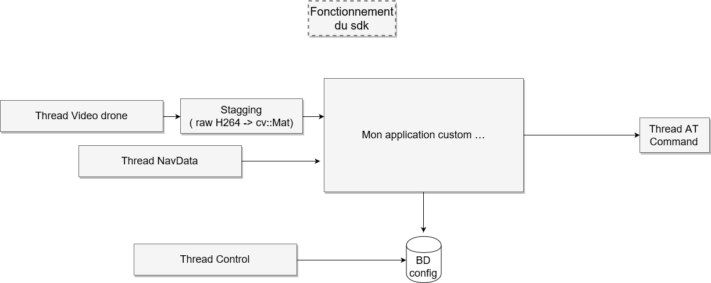

# SCDrone : Self-Control Drone

Projet final dans le cadre de notre cours de Vision dans le programme d'informatique industrielle du Cégep de Lévis-Lauzon.

- [SCDrone : Self-Control Drone](#scdrone--self-control-drone)
    - [Objectif](#objectif)
    - [Technologie utilisé](#technologie-utilis%C3%A9)
    - [Implémentation du SDK du ARDrone 2.0](#impl%C3%A9mentation-du-sdk-du-ardrone-20)
        - [Thread AT](#thread-at)
        - [Thread NavData](#thread-navdata)
        - [Thread Control](#thread-control)
        - [Thread Video](#thread-video)

## Objectif

Crée une application en c++ avec OpenCV qui controlera automatiquement un drone (AR Drone 2.0) dans un cas et environnement prédéfinis par l'application.

Exemple d'appliction possible :

* Voler dans un parcours avec des boîtes a esquiver et des anneaux a traverser pour attérir sur une cible d'hélicoptère
* Identifier une cible comme une personne ou un signe et le suivre à une distance prédéterminer
* Mapper une environnement et s'y déplacer automatiquement pour détecter des intrus ( comme un agent de sécurité )

Aucune application n'est définit pour l'instant mais pour les accomplirs la même base doit être crée avec le drone pour executer l'application.

Le drone fournit par l'école est un AR Drone 2.0 qui vient avec un SDK fournit par la compagnie Parrot.
Mais pour des raisons de plaisirs et compatibilité nous avons décider de réecrire le SDK en c++ moderne.
Pour ce faire nous avons comme références :

* [SDK Parrot]("http://developer.parrot.com/docs/SDK2") :  lien pour télécharger le code source
* [Documentation SDK Parrot](https://drive.google.com/open?id=13GH4rXcP_LP_JtIrr1bc2artrZ25EUrx) : documentation du drone
* [Port du SDK en C# et C++/cli](https://github.com/ARDrone2Windows/SDK) : le github d'un projet en C# qui a réimplémenter le sdk 

## Technologie utilisé 

Les technologies suivantes sont utilisé par au moins une composante : 

* [C++11](https://en.wikipedia.org/wiki/C%2B%2B11) : on pourrait utilisé une version plus récente comme 2017 je suppose mais je pense pas avoir besoin des features sauf peux-être pour le filesystem
* [Boost 1.68](https://www.boost.org/doc/libs/1_68_0/doc/html/) : nous allons utilisé boost pour les composantes suivantes :
    * Asio   : pour communication TCP et UDP
    * Thread : qui revient au même que std::thread mais vu qu'on utilise boost pour le reste autant rester dans le namespace
    * Log    : pour gérer nos niveau de log et wrapper des informations supplémenatire pour faciliter le débuggage
    * Test   : pour effectuer nos test unitaire, j'aurais aimé tester google test mais je veux pas amener trop de dépendences supplémentaire
* [OpenCV 3.4.3](https://docs.opencv.org/3.4.3/) : pour le traitement d'image et nous allons utilisé les fonctionnalités cuda et contrib pour le tracking et la détection d'object.
* ~~[FFMPEG](https://www.ffmpeg.org/documentation.html) : pour faire le demuxing du stream video du drone pour qu'on puisse utilisé les images dans opencv mais je ne suis pas sur si on n'a besoin ou on peut le faire simplement.~~
* [CMake](https://cmake.org/documentation/) : comme système de build pour le projet

Ce choix de librairie permet à notre sdk et notre application d'être compilé sur toute les plateformes majeurs
sans problème sauf pour la dépendence à cuda qui coupe la possiblité d'être executer sur rasberry pi, android,
mingw parmis tant d'autre. Mais va nous permettre j'imagine d'avoir un gain de performance pour réduire le délais
de controle du drone.

## Implémentation du SDK du ARDrone 2.0

La première partit à compléter pour pouvoir accomplir le projet est d'implémenter notre SDK qui ressemble grosso-modo à :

* Thread AT : thread qui s'occupe d'envoyer les commandes de contrôle et de configuration au drone
* Thread NavData : thread qui s'occupe de la réception des informations de pilotage du drone
* Thread Control : thread qui s'occupe de la réception des informations de configuration du drone
* Thread Video : thread qui s'occupe de la réception du flux vidéo du drone

Et dans cette ensemble de thread viennent s'ajouter les threads de l'application qui serait :
* Thread Staging : thread qui s'occupe de la conversion du flux vidéo vers le format désirer pour l'application
* Thread App : thread qui recoit les informations de pilotages et vidéos et qui envoie des commandes pour ajuster




### Thread AT

### Thread NavData

### Thread Control

### Thread Video

Le flux vidéo utilisé par le drone est H264 ( MPEG4.10 AVC ) et il peut être configuré avec les options suivantes :
* FPS : entre 15 et 30
* Bitrate : entre 250kbps et 4Mbps
* Résolution : 360p (640x360) ou 720p (1280x720)

Les structures et les définitions du flux vidéo sont définit dans libardrone/include/video_common.h
Et ce qu'il en résulte comme flux vidéo une fois reconstruit est la structure suivante qui représente une frame :

```c++
struct VideoPacket
{
	long Timestamp;
	long Duration;
	unsigned int FrameNumber;
	unsigned short Height;
	unsigned short Width;
	frame_type_t FrameType;
	ARBuffer Buffer;
}
```

Pour reconstruire cette frame dans un flux vidéo demuxer nous allons utilisé "cudacodec.hpp" de OpenCV. Ce qui sera
très avantageux pour nous car nos opérations de traitement d'image vont être executé en cuda ce qui va éviter une
copie de plus vers le GPU.

Pour utiliser opencv cuda pour accéder a des Mat depuis le flux video nous devons implémenter cv::cudacodec::RawVideoSource pour crée un cv::cudacodec::VideoReader qui est une interface de cv::VideoCapture comme dans le l'exemple suivant

[Documentation cv::cudacodec]("https://docs.opencv.org/3.4.3/d0/d61/group__cudacodec.html")

```c++

class RawVideoSource {
    virtual ~RawVideoSource ()
 
    // Returns information about video file format. More...
    virtual FormatInfo  format () const =0
 
    // Returns next packet with RAW video frame. More...
    virtual bool getNextPacket (unsigned char **data, int *size, bool *endOfFile)=0
};

// Pour l'utiliser de la sorte avec notre implémentation

cv::cuda::GpuMat gframe;
Ptr<VideoReader> videoReader = cv::cudacodec::createVideoReader(myRawVideoSource);

for(;;) {
    if(!videoReader->nextFrame(gFrame)) {
        return :(;
    }
    cv::imshow("GPU", gFrame);
}

```


